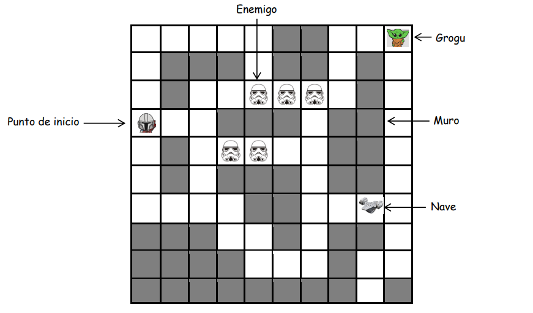
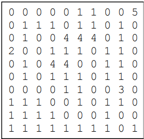

# Smart Mandalorian

 El objetivo de Mando es encontrar a Grogu en un espacio de 10x10 
casillas usando algoritmos de inteligencia artificial. En el ambiente se tiene una nave que Mando 
puede usar para ir más rápido. También hay enemigos que afectan el estado del agente. 
Considere la siguiente abstracción del mundo representado por medio de una cuadrícula de 
10x10. 



En cada búsqueda que emprenda el agente podrá realizar desplazamientos simples tales como 
moverse arriba, abajo, izquierda, y derecha. Tenga en cuenta que el costo de cada movimiento 
es 1. Si Mando va en la nave, el costo de cada movimiento será 1/2 y además podrá pasar por las 
casillas donde haya enemigos sin que lo afecten. La nave solo tiene combustible para 10 casillas. 
Si Mando llega a una casilla donde hay un enemigo y no va en la nave, el costo será 5 (allí está 
incluido el costo del movimiento y del daño ocasionado por el enemigo). En el ambiente siempre 
hay una sola nave, pero la cantidad de enemigos puede variar.

La información del mundo se representa por medio de los siguientes números: 

- 0 si es una casilla libre 
- 1 si es un muro
- 2 si es el punto de inicio
- 3 si es la nave 
- 4 si es un enemigo
- 5 si es Grogu



### La aplicación permite:

- Ingresar los datos de un mundo determinado mediante un archivo de texto.
- Desplegar gráficamente el mundo del agente en su estado inicial.
- Seleccionar el tipo de algoritmo de búsqueda: "No informada" o "Informada".
- Para la búsqueda "No informada", se puede elegir entre "Amplitud", "Costo uniforme" y "Profundidad evitando ciclos".
- Para la búsqueda "Informada", se puede elegir entre "Avara" y "A*".
- Se Muestra una animación en la interfaz gráfica con el conjunto de movimientos realizados por el agente después de aplicar un algoritmo seleccionado.
- Se muestra un reporte con información relevante como la cantidad de nodos expandidos, la profundidad del árbol, el tiempo de cómputo y el costo de la solución encontrada.

### Instalar dependencias:
```shell
pip install -r requirements.txt

```

### Para ejecutar: 
```shell
python GUI.py

```
